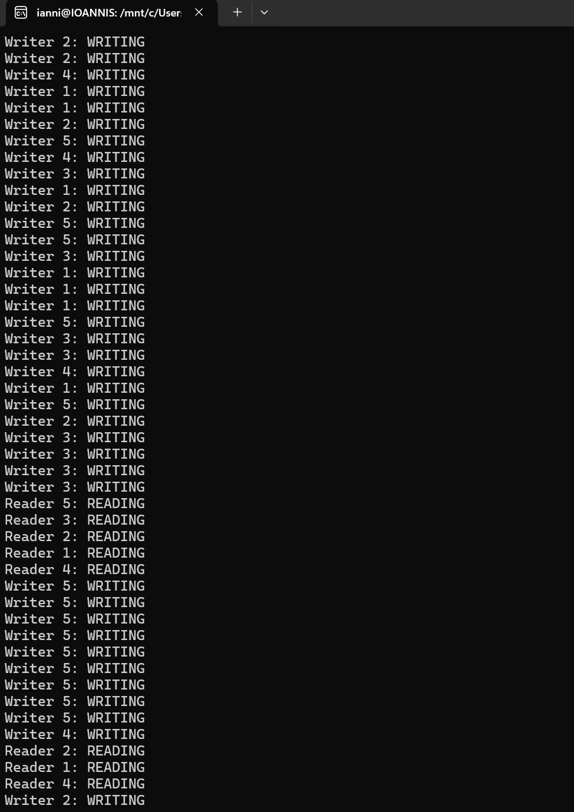
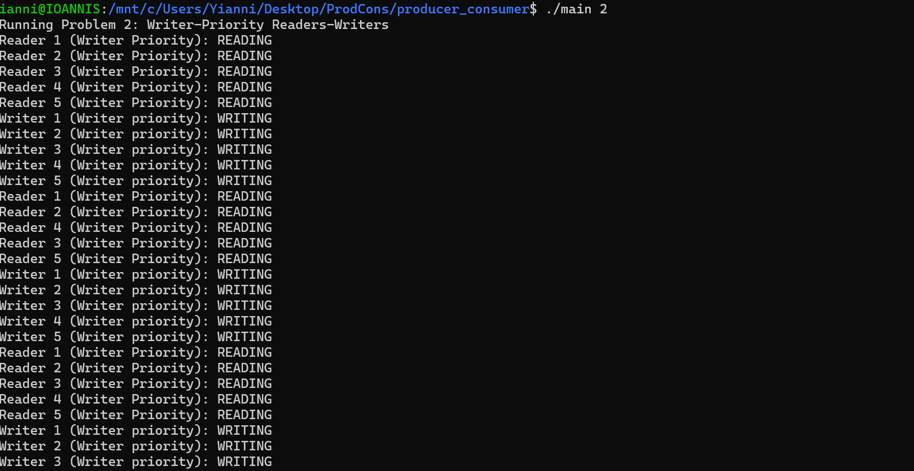
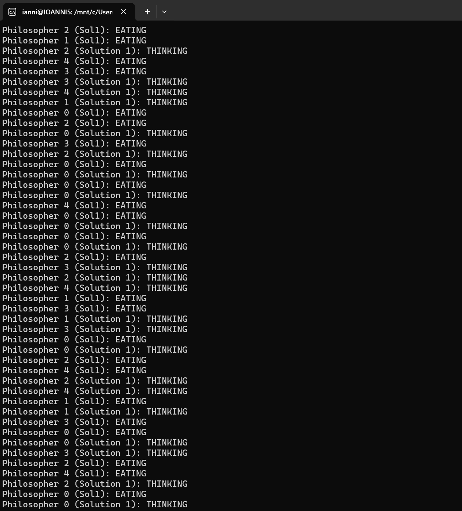

# Ioannis-Limniatis---Multi-thread-synchronization-using-semaphores-HW
Multi-thread synchronization using semaphores for CSE 4001

Output demonstrating that readers and writers take turns fairly.

Output demonstrating that once a writer arrives, readers are blocked allowing for fair eating.

Output showing philosophers thinking and eating, using footmen to avoid deadlocks.

Output showing philosophers thinking and eating using Tanenbaum's solution utilizing left and right.

